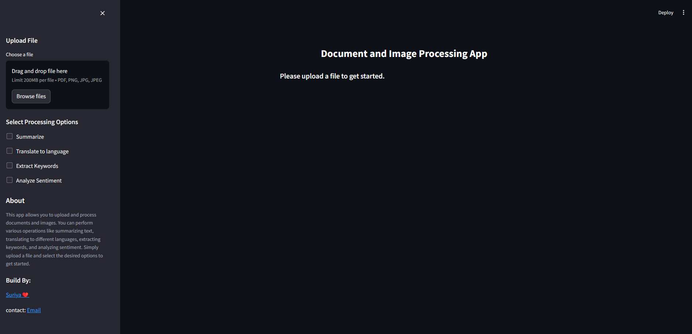

# IntelliDoc App

This Streamlit app allows you to upload and process documents and images. You can perform various operations like summarizing text, translating to different languages, extracting keywords, and analyzing sentiment. Simply upload a file and select the desired options to get started.

## Features

- **Summarize**: Get a concise summary of the uploaded document.
- **Translate**: Translate the text in the document to a specified language.
- **Extract Keywords**: Extract important keywords from the document.
- **Sentiment Analysis**: Analyze the sentiment of the text in the document.
- **Image Processing**: Ask questions related to the uploaded image and get relevant responses.

## Installation

1. **Clone the repository**:
    ```bash
    git clone https://github.com/theSuriya/Docs-and-Image-Process.git
    cd document-image-processing-app
    ```

2. **Create a virtual environment**:
    ```bash
    python -m venv venv
    source venv/bin/activate  # On Windows use `venv\Scripts\activate`
    ```
    
3. **Google API KEY**:
Go to this site to generate api key [HERE](https://aistudio.google.com) You can see left side generate api thn click and copy. Once you have the api key, locate the .env file in your project directory. Open it and paste your aoi key like this:
  ```bash
  GOOGLE_API_KEY = "paste the api key here"
  ```

4. **Install the required dependencies**:
    ```bash
    pip install -r requirements.txt
    ```

## Usage

1. **Run the Streamlit app**:
    ```bash
    streamlit run app.py
    ```

2. **Upload a file**: Choose a PDF, PNG, JPG, or JPEG file to upload.
3. **Select processing options**: Choose one or more of the available processing options (Summarize, Translate, Extract Keywords, Sentiment Analysis).
4. **View results**: The results will be displayed in the main section of the app.

## Example

Upload a PDF or image file, select the desired options, and view the processed results. Here’s a screenshot of the app in action:



## Contributing

Contributions are welcome! Please open an issue or submit a pull request for any changes.

## License

This project is licensed under the MIT License. See the [LICENSE](LICENSE) file for details.

## Contact

For any questions or suggestions, feel free to contact:

- **Suriya S**
- **Email**: thesuriya3@gmail.com
- **GitHub**: [Suriya s](https://github.com/theSuriya)
